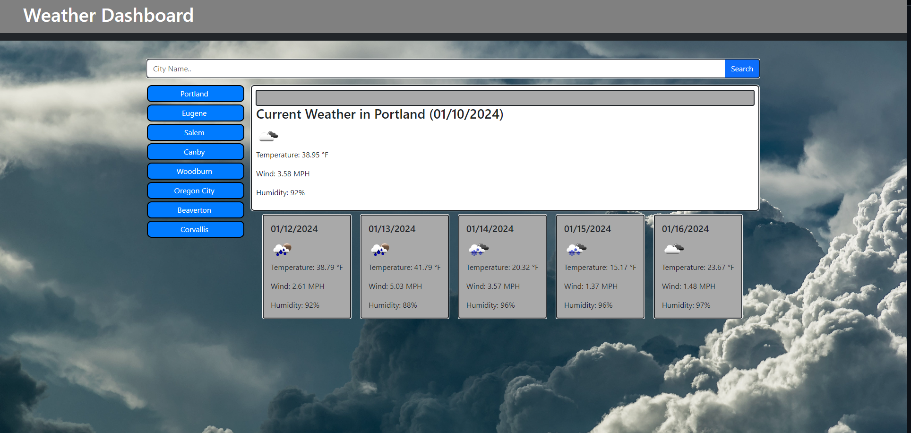

# Weather Dashboard

## Description
A weather app for quick updates and 5-day forecasts. Explore Oregon's cities with preset options or search for any location worldwide. Enjoy adorable weather icons, stay informed with detailed information on temperature and wind speed, and plan your week effortlessly. Powered by Bootstrap for a sleek interface and OpenWeatherMap API for real-time data. 🌦️🌍

## Features
- **Presets for Oregon Locations**: Easily check the weather in popular Oregon cities like Portland, Eugene, Salem, and more!
- **City Search**: Want to know the weather elsewhere? Use the search feature to get instant weather updates for any city.
- **Weather Icons**: Cute little icons help you visualize the current weather conditions at a glance.
- **Detailed Information**: Get real-time information on temperature, wind speed, and humidity for the selected city.
- **5-Day Forecast**: Plan ahead with a 5-day weather forecast to stay prepared for the week.

## Live Preview

## Table of Contents
- [Description](#description)
- [Features](#features)
- [License](#license)
- [Contributors](#contributing)
- [Questions](#questions)

## License
### The MIT License
[https://opensource.org/licenses/MIT](https://opensource.org/licenses/MIT)

## Contributing
If you would like to contribute to this project, please follow the guidelines outlined in the Contributing Guide.

## Questions
If you have questions or need further assistance with this project, please feel free to contact me via:
- E-Mail: CarrilloUriel81@gmail.com
- GitHub: [UCarr81](https://github.com/UCarr81)